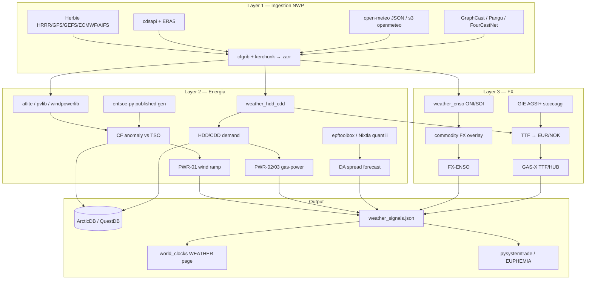

# Stack meteo → economia — OPS DESK

**Manifest zone:** `config/weather_manifest.json`  
**Registry:** `config/data_sources.json` (sector `weather`)  
**Moduli attivi:** `config/modules.json`  
**Pipeline desk:** `open_meteo` → `hdd_cdd` → `enso` → `weather_signals`

Catena completa: **raw NWP → feature fisiche → segnale di trading**, con due rami espliciti verso **energia** (catena corta, P&L diretto) e **FX** (catena lunga, overlay multi-fattore).

---

## Verdetto: dove allocare sforzo

| Ramo | Catena causale | Orizzonte | Edge open source | Allocazione |
|------|----------------|-----------|------------------|-------------|
| **Energia** | vento/sol → rinnovabili → merit order → prezzo spot | ore–giorni | **Alto** — meteo domina DA/intraday | **~80%** |
| **FX** | meteo → commodity → terms of trade → FX | settimane–mesi | **Medio** — overlay su carry/momentum | **~20%** |

**Asimmetria di valore:** in energia il meteo *è* il fattore dominante di prezzo a breve, la catena causale è corta e quasi tutto lo stack è open — è il caso raro dove un team piccolo con ingestion NWP ben fatta compete con i desk. In FX il meteo è fattore di secondo ordine mediato dalle commodity: utile come overlay in pysystemtrade, non come alpha autonomo.

**Regola operativa:** priorità su GRIB→zarr, downscaling e capacity factor (ramo energia). FX = fattore aggiuntivo accanto a carry/momentum/value.

---

## Architettura d'insieme



**Percorso file nel desk oggi:**

```
Herbie / ERA5 / open-meteo
        ↓
   cache/weather/  (+ zarr futuro)
        ↓
 atlite / pvlib / weather_hdd_cdd / weather_enso
        ↓
 cache/spine/modules/*.json  (feature store leggero)
        ↓
 epftoolbox / Nixtla  (forecast quantili — off)
        ↓
 weather_signals → world_clocks UI + spine_build alerts
        ↓
 pysystemtrade (futures FX) / bidding power (EUPHEMIA)
```

---

## Layer 1 — Ingestion dati meteo grezzi (NWP e reanalysis)

### Herbie (Blaylock) — forecast grezzo

Downloader di riferimento per output di modelli numerici: **HRRR, GFS, GEFS, ECMWF IFS/AIFS, RAP, NBM**. Cerca automaticamente su AWS, Google Cloud, NOMADS e Azure; subset per variabile GRIB2; lettura diretta in xarray.

| | |
|--|--|
| **Modulo desk** | `herbie_harvest` (OFF) |
| **Adapter** | `bridge.adapters.herbie.harvest:run` |
| **Nota trading** | Per il trading conta la *distribuzione* dei run **GEFS ensemble**, non il deterministico |

### cdsapi + ERA5 (Copernicus CDS)

Reanalysis di riferimento per lo storico (**1940–oggi**, orario, globale). Dataset di training di ogni modello prezzo-meteo serio e input di atlite/epftoolbox.

| | |
|--|--|
| **Modulo desk** | `era5_harvest` (OFF) |
| **Chiave** | `CDSAPI` (~/.cdsapirc) |

### open-meteo — prototipazione veloce

Server open source che unifica GFS/HRRR, ICON DWD, AROME/ARPEGE, ECMWF, JMA, Met Norway in API JSON (<10 ms). Distribuisce storico+forecast su **AWS Open Data** (`s3://openmeteo`).

| | |
|--|--|
| **Modulo desk** | `weather_open_meteo` (**ON**) — stdlib HTTP, 15 zone |
| **Licenza** | API gratuita per prototipazione; **uso commerciale richiede licenza** |
| **UI C** | `weather.c` (live) + bridge archive 30d + forecast 7d |

### ecCodes / cfgrib + xarray + kerchunk / zarr

Toolchain di pre-processing: **GRIB2 → zarr indicizzato** per accesso cloud-nativo. Metà del valore ingegneristico sta qui: chi indicizza bene i GRIB legge in secondi quello che altri leggono in ore.

| Tool | Pip | Stato desk |
|------|-----|------------|
| cfgrib | `cfgrib` | registry, adapter futuro |
| kerchunk / zarr | `kerchunk`, `zarr` | commentato in `requirements-bridge-weather.txt` |

### Modelli AI weather open source

Forecast a costo marginale quasi zero — edge in energia = avere *il tuo* forecast prima o diverso dal consensus.

| Modello | Autore | Scaricabile via |
|---------|--------|-----------------|
| GraphCast | DeepMind | registry doc |
| Pangu-Weather | Huawei | registry doc |
| FourCastNet | NVIDIA | registry doc |
| AIFS | ECMWF | **Herbie** |

---

## Layer 2 — Meteo → Energia (collegamento diretto, monetizzabile)

**Settore desk:** `energy` — moduli `entsoe_py_harvest`, `epftoolbox_status`, segnali `PWR-*`.

### Catena causale

```
vento / irraggiamento → generazione rinnovabile → merit order → prezzo spot
temperatura → domanda (HDD/CDD) → gas / power → prezzo
precipitazioni / neve → hydro → prezzo (Nord Pool sopra tutti)
```

### Tool e moduli

| Tool | Ruolo | Modulo desk | Stato |
|------|-------|-------------|-------|
| [atlite](https://github.com/PyPSA/atlite) | ERA5/SARAH → capacity factor eolico/solare | `atlite_profiles` | OFF |
| [pvlib](https://github.com/pvlib/pvlib-python) | Irradiance → PV MWh (Sandia) | pip optional | — |
| [windpowerlib](https://github.com/wind-python/windpowerlib) | Curva turbina | pip optional | — |
| [epftoolbox](https://github.com/javieralbacete/epftoolbox) | Forecast DA (load + wind/solar + meteo) | `epftoolbox_status` | OFF |
| Nixtla (neuralforecast / statsforecast) | Forecast quantili / spike risk | pip optional | — |
| `weather_hdd_cdd` | Anomalie HDD/CDD pesate per regione | **ON** | — |
| `weather_signals` | Combina meteo + TTF/HUB → segnali | **ON** | — |

### Trade classico

**Il tuo forecast eolico vs quello pubblicato dal TSO** (entsoe-py) — il delta è direzionale sul prezzo intraday. Stack quantile (LightGBM / statsmodels / neuralforecast) per passare da punto a distribuzione quando i prezzi spikeano a 10×.

### Segnali concreti (attivi in `weather_signals`)

| ID | Segnale | Meccanismo |
|----|---------|------------|
| `PWR-02` | Anomalia HDD/CDD EU | Domanda gas/power → prezzo |
| `PWR-03` | HDD US | Proxy domanda HH gas |
| `PWR-01` | Wind forecast ramp (PDE, PFR, PIT…) | Spread day-ahead / intraday |
| *(futuro)* | Snowpack / inflow scandinavi | Prezzi Nord Pool a termine (zone OSL, HEL) |

**Zone manifest → power desk:** BER→PDE, PAR→PFR, MIL→PIT, AMS→PNL, WAW→PPL (vedi `config/weather_manifest.json`).

---

## Layer 3 — Meteo → FX (collegamento indiretto, via commodity)

**Settore desk:** `fx` — moduli `fx_graph`, `fx_carry`, `pysystemtrade_export`, overlay `FX-ENSO`.

Catena più lunga e lenta → tradabile a orizzonti **settimanali/mensili** senza svantaggio di latenza.

### Collegamenti causali

| Shock meteo | Meccanismo | FX / asset |
|-------------|------------|------------|
| Inverni rigidi Europa | Domanda gas TTF → bilancia energetica | **EUR** (importatore), **NOK/ENK** (esportatore) |
| El Niño / La Niña (ONI, SOI) | Prezzi agricoli e metalli → terms of trade | **AUD, BRL, ZAR, CLP, NZD** |
| Siccità / idrologia LATAM | Raccolti | **BRL** |
| Monsone debole | Inflazione alimentare → RBI | **INR** (zone MUM) |

### Stack operativo FX

```
Herbie / open-meteo (anomalie termiche)
        +
GIE AGSI+ (stoccaggi gas EU)     ← research/run_gas.py, ENTSOG
        +
Regressione / overlay sistematico → EURNOK, carry/momentum in pysystemtrade
```

| Feature | Fonte | Modulo desk |
|---------|-------|-------------|
| ONI / fase ENSO | NOAA CPC ascii | `weather_enso` **ON** |
| SOI / altri indici | NOAA CSV | feature engineering manuale |
| HDD EU pesato | open-meteo zones | `weather_hdd_cdd` |
| Commodity FX mapping | `weather_manifest.enso.fx_commodity_pairs` | `weather_signals` → `FX-ENSO` |
| TTF vs HUB | spine gas series | `weather_signals` → `GAS-X` |

**Letteratura:** shock ENSO documentati sui terms of trade di AUD/BRL/ZAR/CLP/NZD. Il grafo desk mostra già correlazioni commodity-FX (es. BRL vs cluster agricolo).

**Integrazione pysystemtrade:** export anomalie meteo (`cache/exports/pysystemtrade/`) come **fattore extra** accanto a carry, momentum e value — non sostituto del sistema sistematico.

---

## Collegamenti espliciti ai due settori

| Da meteo | → Energia | → FX |
|----------|-----------|------|
| Wind speed / CF | `PWR-01`, entsoe gen delta, epftoolbox | — |
| HDD/CDD anomaly | `PWR-02`, `PWR-03`, gas demand | TTF → EUR/NOK via `GAS-X` |
| ENSO ONI | — | `FX-ENSO` → AUD/BRL/ZAR/CLP/NZD |
| Precip / snowpack | Nord Pool forward (futuro) | NOK hydro export |
| Monsone | — | INR overlay (futuro, zone MUM) |

**Cross-module nel build:** `scripts/spine_build.py` merge alert meteo (`PWR-01`, `GAS-X`) in `signals_live.json` per pagina OPS.

---

## Comandi

```powershell
# Pipeline meteo attiva (stdlib + HTTP, nessun pip):
python scripts\spine_build.py

# Stack NWP completo (Herbie, ERA5, atlite, quantili):
pip install -r requirements-bridge-weather.txt
.\scripts\install_bridge_extras.ps1 -Sector weather
```

### Output

| Path | Contenuto |
|------|-----------|
| `cache/weather/open_meteo/{ZONE}.json` | Archive + forecast per zona |
| `cache/spine/modules/weather_hdd_cdd.json` | Anomalie HDD/CDD EU/US/NORD |
| `cache/spine/modules/weather_enso.json` | Fase ONI + mapping FX |
| `cache/spine/modules/weather_signals.json` | Segnali PWR/FX/GAS |
| `cache/exports/pysystemtrade/*.csv` | Proxy futures per overlay FX |

**UI:** pagina **WEATHER** → pannello **METEO SIGNALS** (`src/modules.c`). Pagina **FX** → moduli graph/carry a destra.

---

## Prossimi step ingegneristici (priorità energia)

1. **Herbie GEFS ensemble** → distribuzione vento (non solo deterministico) → zarr
2. **ERA5 + atlite** → CF zone PDE/PFR vs gen pubblicata ENTSO-E
3. **epftoolbox LEAR** con feature meteo + export hourly ENTSO-E
4. **Snowpack / inflow** nordici → segnale Nord Pool (OSL, HEL nel manifest)
5. Promuovere `PWR-02` in `config/signals.json` dopo backtest

---

## Riferimenti

- Registry machine-readable: `config/data_sources.json`
- Stack generale OSS: `docs/STACK_OPEN_SOURCE.md`
- Moduli bridge: `docs/MODULES.md`
- Strategia: `STRATEGY.md` (Fase 2 meteo→economia)
