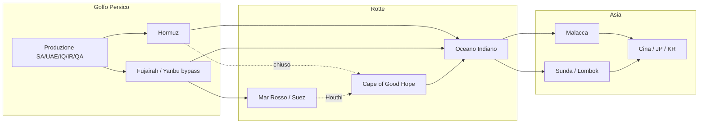

# Chokepoints e rotte marittime — post-Hormuz 2026

**Aggiornato:** 2026-07-07  
**Contesto:** il modello pre-2024 (Hormuz = unico collo di bottiglia) è obsoleto. La crisi febbraio–giugno 2026 ha rivelato una **catena sequenziale** di nodi e accelerato bypass permanenti.

---

## 1. Il cambio di paradigma

### Prima (modello vecchio)
- Hormuz = rischio #1 per oil/LNG
- Malacca = "problema cinese" secondario
- Rotte analizzate in isolamento

### Ora (modello corretto)
> **Hormuz e Malacca non sono rischi separati — sono nodi sequenziali sulla stessa supply chain.**

- ~**84%** del petrolio che transita Hormuz è destinato all'Asia; la maggior parte prosegue verso est attraverso **Malacca** ([VanEck 2025](https://www.vaneck.com/us/en/blogs/natural-resources/malacca-the-strait-nobodys-watching/))
- Stress al nodo 1 (Hormuz) **non elimina** il nodo 2 — lo **amplifica** (premio routing, congestione, assicurazioni)
- Quando il Mar Rosso/Suez si chiude, Malacca diventa **più trafficato**, non meno ([Straits Times 2026](https://www.straitstimes.com/asia/se-asia/explainer-hormuz-crisis-throws-spotlight-on-worlds-largest-chokepoint-the-malacca-strait))

**Implicazione desk:** monitorare **rapporto transiti** tra chokepoints, non solo prezzo spot BRT/TTF.

---

## 2. Volumi baseline (EIA 1H25)

| Chokepoint | Oil flow (mb/d) | % maritime oil | LNG | Note |
|------------|-----------------|--------------|-----|------|
| **Malacca** | **23.2** | **29%** | 9.2 Bcf/d (~20% trade) | **Più grande al mondo** per volume oil |
| **Hormuz** | 20.9 | 20% | ~112 bcm/yr (20% LNG) | ~80% verso Asia |
| Bab el-Mandeb | 4.2 | — | — | Doppio choke con Suez |
| Suez + SUMED | 4.9 | — | — | Crollato con Houthi 2026 |
| Cape of Good Hope | alt route | — | — | +3,500 NM, +10–20 giorni |

Fonte: [EIA World Oil Transit Chokepoints](https://www.eia.gov/international/content/analysis/special_topics/World_Oil_Transit_Chokepoints)

**Malacca supera Hormuz** in volume oil dal 1H25. La crisi Hormuz 2026 ha spostato l'attenzione geopolitica su ciò che i mercati ignoravano.

---

## 3. Crisi Hormuz febbraio–giugno 2026 — cosa è cambiato

### Impatto immediato
- Traffico Hormuz: **-90%** (4 navi/giorno vs media 7gg, Windward, 3 mar 2026) ([Anadolu](https://www.aa.com.tr/en/economy/global-trade-reroutes-to-cape-of-good-hope-while-traffic-in-strait-of-hormuz-plunges-90-/3851150))
- Cape of Good Hope: **+35%** transiti stesso giorno
- Assicurazioni guerra: cancellate per Golfo; premio freight raddoppiato in alcuni corridoi
- **LNG verso Europa deviato verso Asia** per prezzo (tanker ribaltato a metà rotta)

### Bypass operativi (non teorici — in uso)

| Rotta | Capacità | Stato 2026 | Limiti |
|-------|----------|-----------|--------|
| **UAE ADCOP** Habshan→Fujairah | 1.8 mb/d → **espansione 3–3.4 mb/d** | Operativo; espansione ADNOC annunciata mag 2026 | Attacchi drone su Fujairah; Jebel Ali (Golfo) isolato |
| **Saudi Petroline** Est→Yanbu (Mar Rosso) | Design 7 mb/d; **~3–5 mb/d spare** | Critico nella crisi | Secondo choke: Bab el-Mandeb/Red Sea |
| **Iraq Kirkuk–Ceyhan** | ~250 kb/d | Riaperto set 2025 | Frazione export Iraq |
| **Iran Goreh–Jask** | 1 mb/d design | Quasi non operativo | Sanzioni + terminale incompleto |
| **Iraq Basra–Duqm (Oman)** | 1 mb/d proposto | Concept stage | — |
| **Iraq Basra–Aqaba** | 1 mb/d proposto | Concept stage | — |

Fonti: [IEA Hormuz](https://www.iea.org/about/oil-security-and-emergency-response/strait-of-hormuz), [The Conversation apr 2026](https://theconversation.com/what-alternatives-do-gulf-states-have-to-the-strait-of-hormuz-281805), [The National mag 2026](https://www.thenationalnews.com/business/energy/2026/05/17/how-strait-of-hormuz-disruption-is-forcing-gulf-transit-towards-pipelines-and-rail/)

### Vulnerabilità strutturali esposte
| Paese | Bypass? | Crisi |
|-------|---------|-------|
| **Qatar** | **NO** per LNG | 77 Mt/yr Ras Laffan — **100% via Hormuz**, nessuna pipeline |
| **Kuwait** | **NO** | Force majeure mar 2026 |
| **Bahrain** | **NO** | Accesso marittimo solo via Hormuz |
| **UAE** | Parziale (Fujairah) | Container hub Jebel Ali nel Golfo = tagliato |

> **LNG non ha bypass pipeline.** Perdita Qatar = -300 mcm/d, impossibile sostituire a breve ([IEA](https://www.iea.org/about/oil-security-and-emergency-response/strait-of-hormuz))

---

## 4. Malacca — il vero sistema nervoso

### Numeri chiave
- **23.2 mb/d** oil (1H25) — 29% maritime oil trade
- **~102,500** transiti commerciali 2025 (+8.7% vs 2024) — Malaysia Marine Dept
- **48%** del crude in transito → **Cina** (~7.9 mb/d)
- **75%** delle importazioni oil marittime cinesi passano da Malacca
- Fornitori dominanti nel corridoio: **Arabia Saudita, UAE, Kuwait, Iraq** (~60% del crude)
- **Qatar = 28%** del LNG nel corridoio (da 14% nel 2020)

### Rischi emergenti (2025–2026)
1. **STS illegale** — trasbordi nave-a-nave per offuscare origine (sanctions evasion) — Malaysia/Singapore
2. **Malacca Dilemma** — timore blocco da "potenze" in caso conflitto Taiwan/South China Sea ([Atlas Institute 2025](https://atlasinstitute.org/navigating-the-malacca-dilemma-in-2025/))
3. **Congestione** — 2.8 km larghezza minima; VLCC fully loaded spesso non passano (draft 25m)
4. **Pirateria** — bassa ma non zero; rischio assicurativo

### Alternative a Malacca

| Rotta | Extra distanza | Extra tempo | Draft | Uso tipico |
|-------|----------------|-------------|-------|------------|
| **Sunda** (Java-Sumatra) | +450 NM | +2–7 gg | 25–30m (canale centrale) | VLCC fully loaded |
| **Lombok** (Bali-Lombok) | +700 NM | +4–8 gg | 250m+ | ULCC, monsoon safety |
| **Myanmar–Yunnan pipeline** | bypass marittimo | — | 22 Mt/yr (~440 kb/d) | Cina SW only |
| **Cape of Good Hope** | +3,500 NM | +10–20 gg | illimitato | Reroute globale post-Hormuz/Red Sea |

Combined Sunda+Lombok: **<5%** del volume Malacca — valvola di sfogo, non sostituto ([Ballast Markets](https://content.ballastmarkets.com/chokepoints/sunda-strait/))

---

## 5. Rotte "nuove" da monitorare (post-2026)

### Tier 1 — Segnali real-time (AIS + port data)
| ID | Zona | Cosa misurare | Segnale |
|----|------|---------------|---------|
| RT-01 | Hormuz (26.56°N 56.25°E) | Tanker count/day, VLCC vs product | Ripresa post-ceasefire vs "nuova normalità" |
| RT-02 | Fujairah / Khor Fakkan | Loadings, anchorage | Bypass UAE effectiveness |
| RT-03 | Yanbu / Jeddah (Red Sea) | Petroline export | Saudi bypass + 2° choke risk |
| RT-04 | Malacca (2–3°N 101°E) | Transiti totali, VLCC % | Binding constraint Asia |
| RT-05 | Sunda + Lombok | Transiti vs baseline | Stress proxy (VLCC diversion) |
| RT-06 | Cape of Good Hope | Tanker count vs 7d MA | Global reroute intensity |
| RT-07 | Bab el-Mandeb | Transiti | Red Sea viability |
| RT-08 | Kyaukpyu (Myanmar) | VLCC discharge | China land bypass |

### Tier 2 — Segnali prezzo/spread
| ID | Segnale | Driver |
|----|---------|--------|
| RS-01 | TTF−BRT spread vs storico | EU-Asia arbitrage + routing cost |
| RS-02 | Dubai-Oman spread vs Brent | Gulf grade premium post-Hormuz |
| RS-03 | LNG JKM vs TTF vs HH | LNG diversion Asia/EU |
| RS-04 | VLCC freight TD3C (Gulf→China) | Hormuz risk premium |
| RS-05 | War risk insurance Gulf | Accessibilità commerciale |

### Tier 3 — Bypass producers (non toccano né Hormuz né Malacca)
- US Gulf Coast LNG → Asia via Cape/Suez
- Russian Sakhalin/Arctic LNG → China (sanctions discount)
- West Africa crude → Asia
- Australian LNG/coal → Asia (no Hormuz)
- Canadian oil sands → Pacific

([VanEck bypass producers thesis](https://www.vaneck.com/us/en/blogs/natural-resources/malacca-the-strait-nobodys-watching/))

---

## 6. Catena causale per il desk

**Regola:** un shock a Hormuz si propaga a Malacca con lag 2–4 settimane (tempo navigazione + inventory drawdown).

---

## 7. Dati da integrare nel progetto

| Fonte | Dato | Path desk | Priorità |
|-------|------|-----------|----------|
| EIA Chokepoints | Volumi storici per stretto | `research/data/eia_chokepoints.json` | P0 |
| AISStream | Posizioni live | `cache/ais.key` → pagina N | P0 |
| Kpler / Vortexa | Loadings Fujairah, STS Malacca | API paid | P1 |
| IMF PortWatch | Transit counts per chokepoint | Free API | P1 |
| Clarksons / Baltic Exchange | VLCC freight TD3C | Paid / scrape | P1 |
| Windward / MarineTraffic | Historical transit | Paid | P2 |

---

## 8. Segnali accademici e policy

- [Disrupt.sc Hormuz supply chains PDF](https://disrupt-sc.io/research/hormuz/assets/CC_Hormuz_SupplyChains.pdf) — Fujairah bypass = highest ROI per Golfo
- [IEA WEO 2024](https://iea.blob.core.windows.net/assets/5e9122fc-9d5b-4f18-8438-dac8b39b702a/WorldEnergyOutlook2024.pdf) — 20% oil+LNG via Hormuz; spare capacity 8 mb/d entro 2030
- [Eurasia Review Lombok 2026](https://www.eurasiareview.com/11052026-lombok-strait-as-an-alternative-to-the-malacca-strait-prospects-and-challenges-analysis/) — infrastruttura Indonesia per alternativa Malacca

---

## Sources

- [EIA World Oil Transit Chokepoints](https://www.eia.gov/international/content/analysis/special_topics/World_Oil_Transit_Chokepoints)
- [IEA Strait of Hormuz](https://www.iea.org/about/oil-security-and-emergency-response/strait-of-hormuz)
- [Straits Times — Hormuz throws spotlight on Malacca](https://www.straitstimes.com/asia/se-asia/explainer-hormuz-crisis-throws-spotlight-on-worlds-largest-chokepoint-the-malacca-strait)
- [VanEck — Malacca nobody's watching](https://www.vaneck.com/us/en/blogs/natural-resources/malacca-the-strait-nobodys-watching/)
- [The Conversation — Gulf alternatives to Hormuz](https://theconversation.com/what-alternatives-do-gulf-states-have-to-the-strait-of-hormuz-281805)
- [Anadolu — Hormuz -90%, Cape +35%](https://www.aa.com.tr/en/economy/global-trade-reroutes-to-cape-of-good-hope-while-traffic-in-strait-of-hormuz-plunges-90-/3851150)
- [The National — pipelines and rail May 2026](https://www.thenationalnews.com/business/energy/2026/05/17/how-strait-of-hormuz-disruption-is-forcing-gulf-transit-towards-pipelines-and-rail/)
- [Atlas Institute — Malacca Dilemma 2025](https://atlasinstitute.org/navigating-the-malacca-dilemma-in-2025/)
- [Global Energy Monitor — Sino-Myanmar pipeline](https://www.gem.wiki/Sino-Myanmar_Oil_Pipeline)
- [Ballast Markets — Sunda/Lombok alternatives](https://content.ballastmarkets.com/chokepoints/sunda-strait/)
