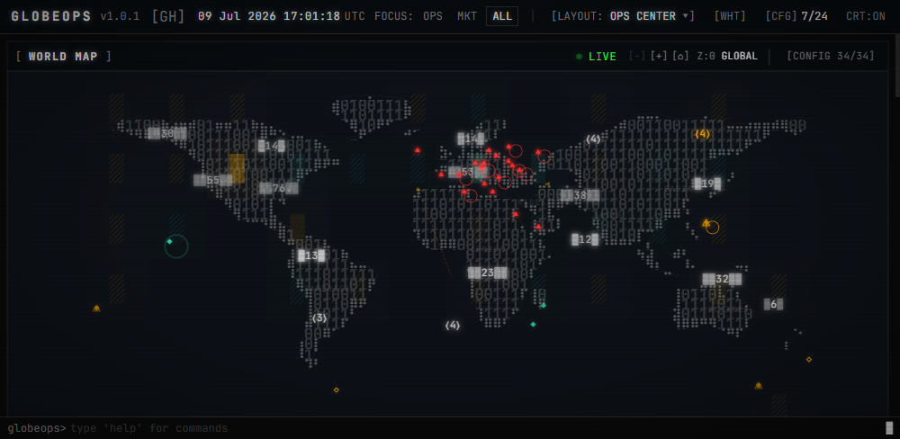

# GlobeOps

- **Fonti dati:** [GlobeOps live desk](https://globeops.cloud/) · [elenco completo](../data-sources/02-globeops.md)
- **Demo live:** https://globeops.cloud/
- **Stack:** React 19, TypeScript, Vite, Tailwind, Zustand
- **Licenza:** MIT

## Screenshot UI

## Dati free / open (ingestion)

**Elenco completo fonti dati (uno per uno):** [data-sources/02-globeops.md](../data-sources/02-globeops.md)

**Nessuna API key obbligatoria.** Dashboard completa senza configurazione.

### RSS (97 feed, 25 categorie)

News mondiali, defense, governo, think tank, finance, tech, science, energy, cybersecurity, climate, disastri, commodity, maritime, nuclear, space + feed regionali (Asia, Europa, MENA, Africa, LATAM, Pacific, Russia).

### API live gratuite

| Fonte | Dati | Refresh |
|-------|------|---------|
| **USGS** | Terremoti | 5 min |
| **NASA EONET** | Eventi naturali | 15 min |
| **NOAA** | Allerte meteo | 15 min |
| **GDELT** | Eventi geopolitici | 15 min |
| **CoinGecko** | Crypto | 60 sec |
| **Polymarket** | Prediction markets | 5 min |
| **OpenSky** | Tracking aerei | 30 sec |

### Dataset statici (bundled)

Installazioni militari, siti nucleari, pipeline, datacenter, rotte maritime, corsi d'acqua strategici.

### Opzionali (migliorano AI / conflitti)

| Variabile | Fonte |
|-----------|-------|
| `AI_GOOGLE_KEY` | Gemini (brief AI) |
| `AI_ANTHROPIC_KEY` | Claude |
| `AI_OPENAI_KEY` | GPT |
| `VITE_ACLED_API_KEY` | ACLED conflitti armati |

Senza chiavi AI: fallback keyword analysis locale (nessuna chiamata cloud).
