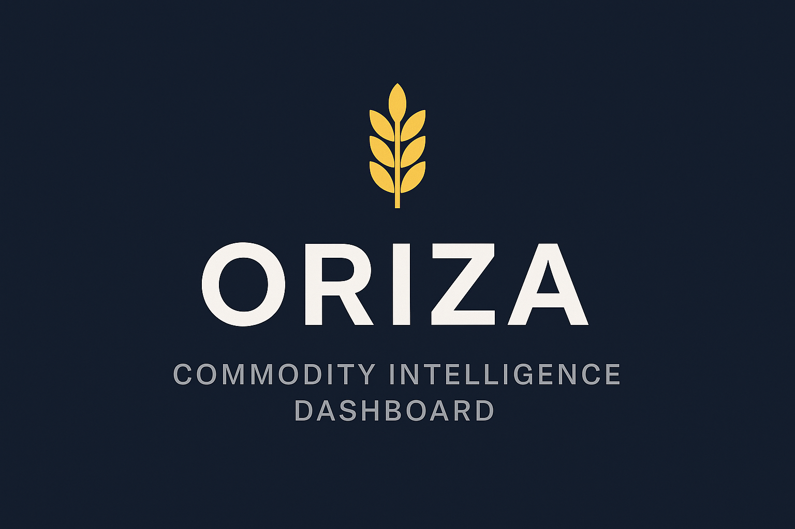
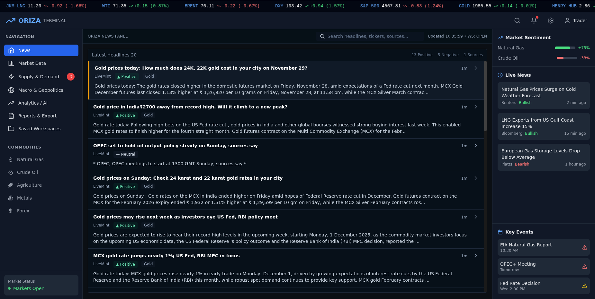

# Oriza

- **Fonti dati:** [EIA Open Data + commodity RSS](https://www.eia.gov/opendata/) · [elenco completo](../data-sources/04-oriza.md)
- **Demo:** `localhost:5173` (self-host)
- **Stack:** FastAPI, Postgres, Scrapy, Playwright, React
- **Licenza:** —

## Screenshot UI

## Dati free / open (ingestion)

**Elenco completo fonti dati (uno per uno):** [data-sources/04-oriza.md](../data-sources/04-oriza.md)

Progetto commodity desk (gas, crude, metalli, agro). Pipeline ingestion dichiarata nel README:

| Tipo | Fonte | Note |
|------|-------|------|
| **RSS** | Feed news commodity | Ingestion + dedup |
| **API pubbliche** | Non enumerate nel README | News/sentiment |
| **Scraping** | Scrapy + Playwright | Siti web commodity |
| **EIA** | US Energy Information | Storage, produzione |
| **OPEC** | Calendario eventi | Macro energia |
| **Meteo** | Forecast API | Demand-side |
| **Alternative** | Satellite flaring, port congestion, NDVI | Planned/mentioned |
| **Macro** | DXY, tassi, inflazione | Cross-asset |

*Nessuna lista connector completa nel repo — architettura ancora in sviluppo.*
