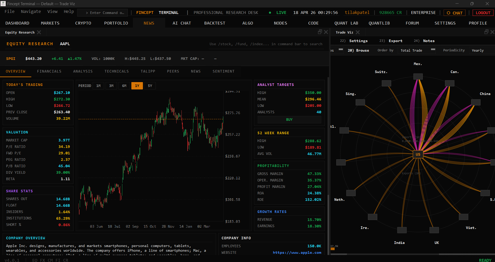
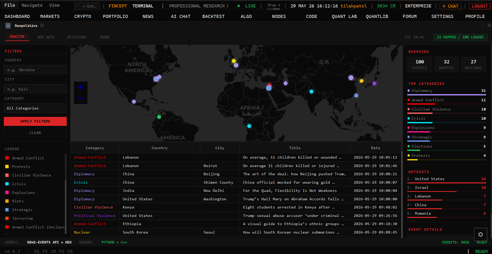
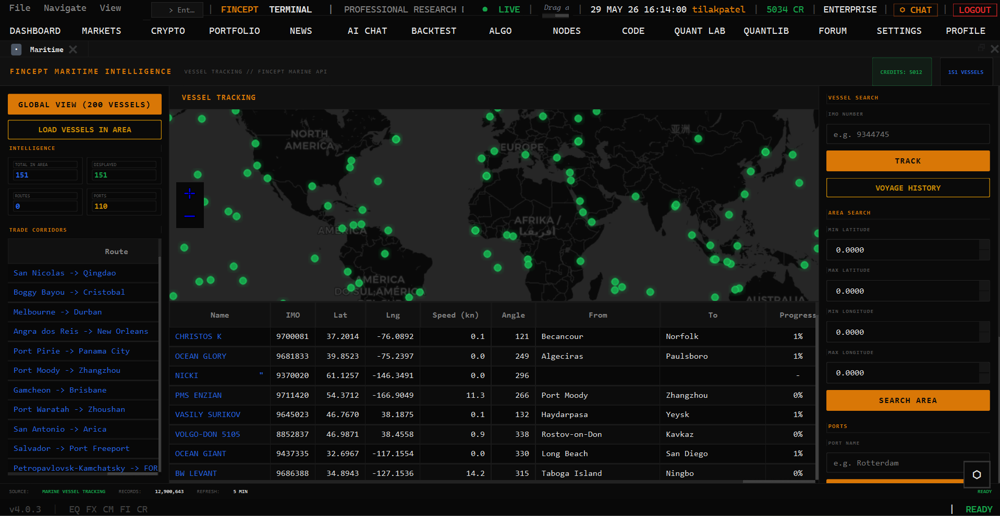
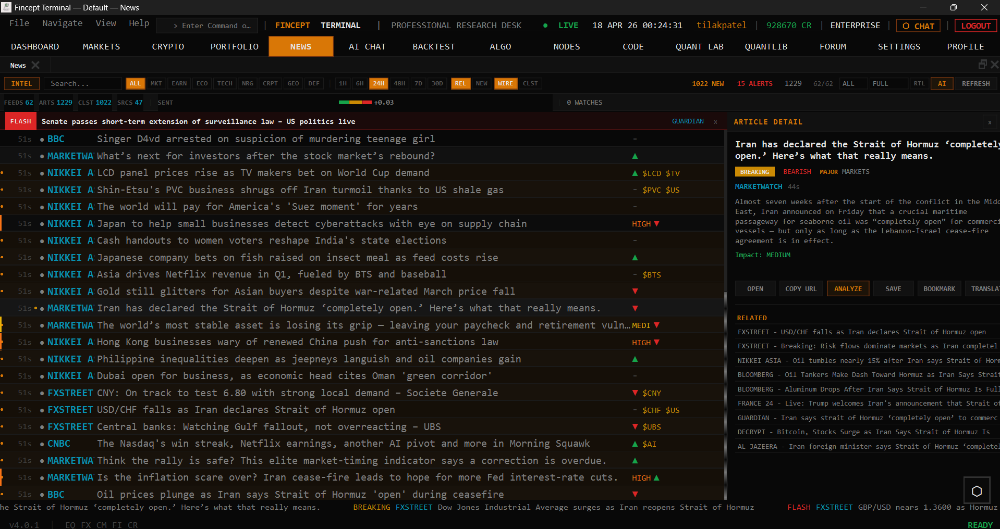
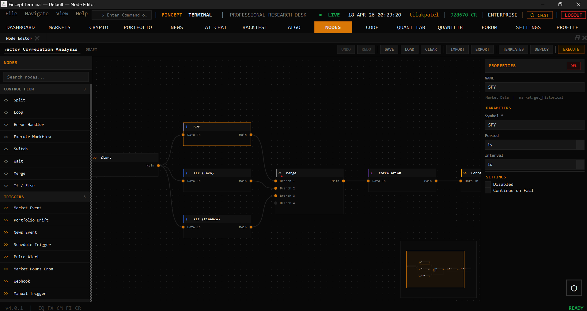

# Fincept Terminal

- **Fonti dati:** [Fincept connectors & data API](https://fincept.co/) · [elenco completo](../data-sources/05-fincept-terminal.md)
- **Stack:** C++20, Qt6, Python embedded
- **Licenza:** AGPL-3.0 (+ licenza commerciale per uso business)

## Screenshot UI

## Dati free / open (ingestion)

**Elenco completo fonti dati (uno per uno):** [data-sources/05-fincept-terminal.md](../data-sources/05-fincept-terminal.md)

**Tier free AGPL:** bring your own data. Connettori citati nel README:

### Free / open (no costo API)

| Connettore | Dati |
|------------|------|
| **Yahoo Finance** | Equity, ETF, macro |
| **FRED** | Serie macro US (key free) |
| **IMF** | Dati sovrani |
| **World Bank** | Macro globale |
| **DBnomics** | Database economici open |
| **AkShare** | Mercati Cina |
| **Government APIs** | Vari dataset pubblici |
| **Kraken** (public) | Crypto OHLCV WebSocket |

### Free tier con account

| Connettore | Dati |
|------------|------|
| **Polygon** | Mercati US (tier limitato) |
| **Alpaca** | IEX market data free con account |
| **Ollama** | AI locale |

### A pagamento / crediti Fincept

Feed proprietari Fincept Data, Adanos sentiment, tier commerciali. **350 API credit free** al signup — poi pay-per-use o licenza commerciale ($10.200/anno).
