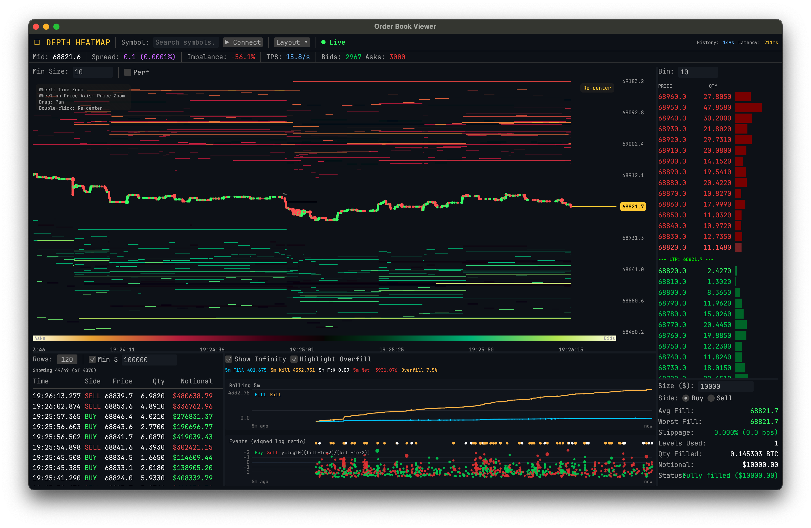

# OpenBook

- **Fonti dati:** [Binance Futures WebSocket depth](https://developers.binance.com/docs/derivatives/usds-margined-futures/websocket-market-streams) · [elenco completo](../data-sources/07-openbook.md)
- **Stack:** Rust, egui, egui_tiles, eframe
- **Licenza:** —

## Screenshot UI

## Dati free / open (ingestion)

**Elenco completo fonti dati (uno per uno):** [data-sources/07-openbook.md](../data-sources/07-openbook.md)

**100% pubblico Binance Futures — nessuna API key.**

| Protocollo | Endpoint | Dati |
|------------|----------|------|
| **WebSocket** | `@depth@100ms` | Order book depth |
| **WebSocket** | `@aggTrade` | Trade tape |
| **REST** | Depth snapshot | Book iniziale |
| **REST** | Exchange info | Simboli, filtri |
| **REST** | Mini-ticker | Prezzi |

Pannelli: heatmap depth stile Bookmap, order book, market impact, Fill:Kill, trades tape. Workspace dockabile con persistenza layout.
