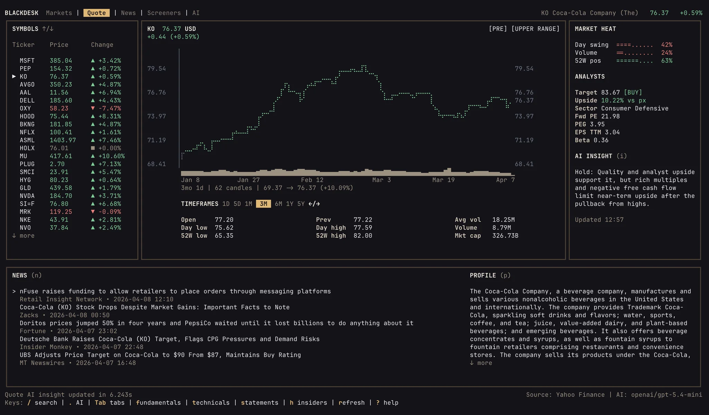

# Blackdesk

- **Fonti dati:** [Yahoo Finance poll](https://finance.yahoo.com/) · [elenco completo](../data-sources/09-blackdesk.md)
- **Stack:** Go, Bubble Tea TUI
- **Licenza:** Apache 2.0

## Screenshot UI

## Dati free / open (ingestion)

**Elenco completo fonti dati (uno per uno):** [data-sources/09-blackdesk.md](../data-sources/09-blackdesk.md)

| Fonte | Dati | Auth |
|-------|------|------|
| **Yahoo Finance** | Quote, chart, technicals, fundamentals, statements, insiders | Nessuna key (adapter non ufficiale) |

### AI (locale, no cloud)

Connettori CLI: **Codex**, **Claude Code**, **OpenCode** — contesto desk passato all'agente installato localmente.

### Workspace

`Quote` · `Markets` · `News` · `Screeners` · `AI` — tutti keyboard-first (`/`, `Tab`, `1-5`).
