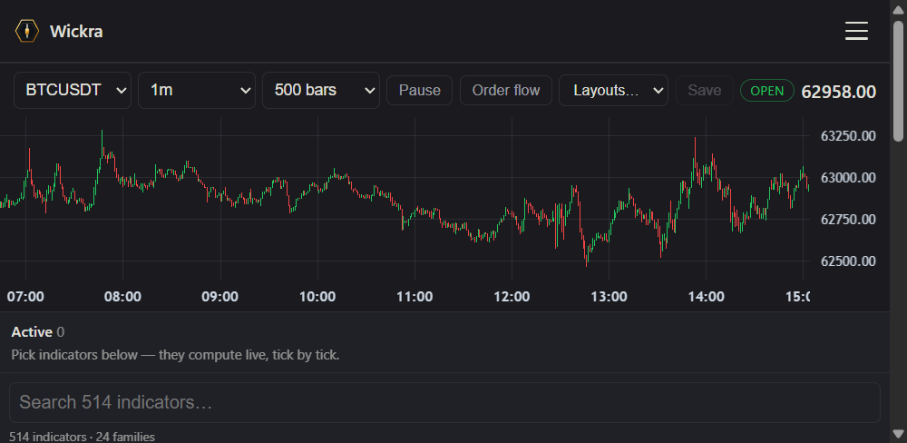

# wickra-terminal

- **Fonti dati:** [Exchange REST/WS (514 indicators)](https://api.binance.com/) · [elenco completo](../data-sources/11-wickra-terminal.md)
- **Demo live:** https://live.wickra.org
- **Stack:** Rust, ratatui (TUI), Vue (Web), WASM
- **Licenza:** MIT OR Apache-2.0

## Screenshot UI

## Dati free / open (ingestion)

**Elenco completo fonti dati (uno per uno):** [data-sources/11-wickra-terminal.md](../data-sources/11-wickra-terminal.md)

| Fonte | Dati | Auth |
|-------|------|------|
| **Binance** (public) | Live BTC/USDT e altri — chart, book, tape | Nessuna key (demo live) |
| **Synth** | Feed deterministico sintetico | Offline, no network |
| **wickra-backtest Replay** | Feed registrati | File locale |

514 indicatori streaming su core unico. Renderer selezionabile: `--render tui|web`. Default read-only / paper mode.
