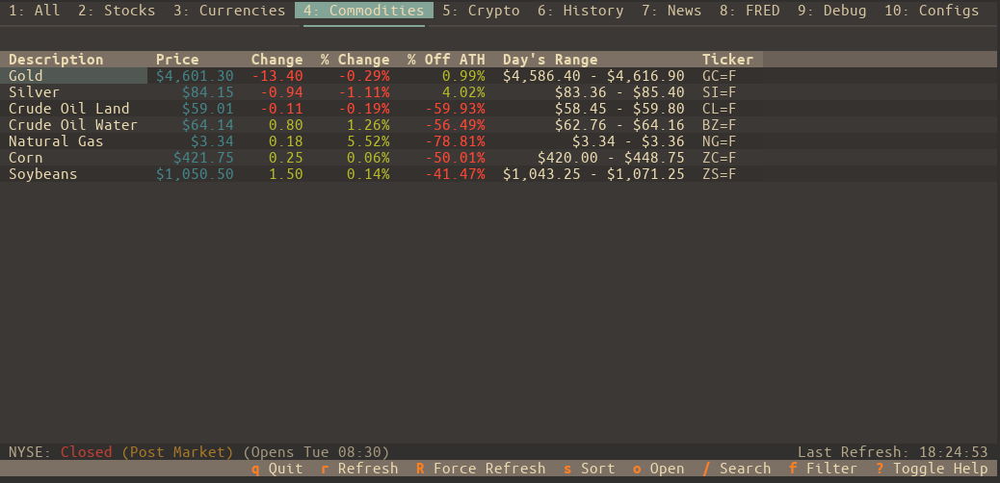
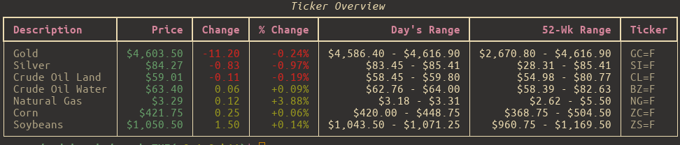
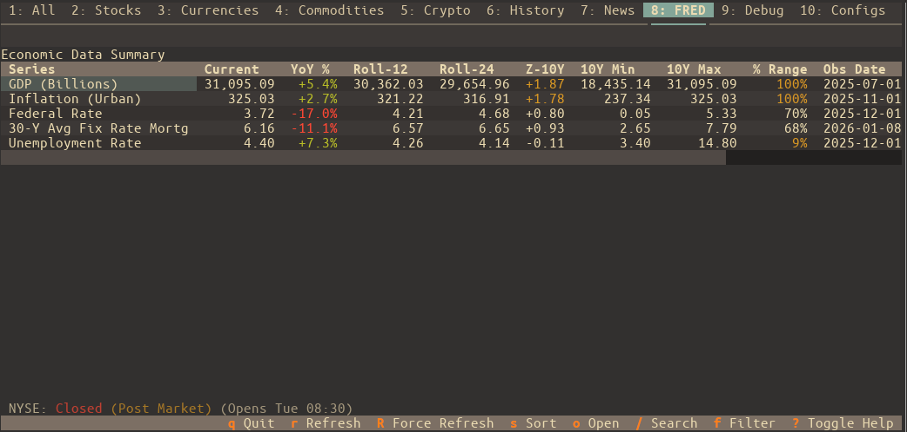

# stocksTUI

- **Fonti dati:** [yfinance + FRED API](https://fred.stlouisfed.org/docs/api/fred/) · [elenco completo](../data-sources/12-stockstui.md)
- **Stack:** Python, Textual, yfinance
- **Licenza:** —

## Screenshot UI

## Dati free / open (ingestion)

**Elenco completo fonti dati (uno per uno):** [data-sources/12-stockstui.md](../data-sources/12-stockstui.md)

| Fonte | Dati | Auth |
|-------|------|------|
| **Yahoo Finance** (yfinance) | Prezzi, crypto, opzioni, news, storico | Nessuna key |
| **FRED** | GDP, CPI, serie macro | **Free API key** richiesta |

Feature: watchlist, chart 1D–Max, options chain con greci, portfolio, calendario economico, ATH/PE/market cap.
