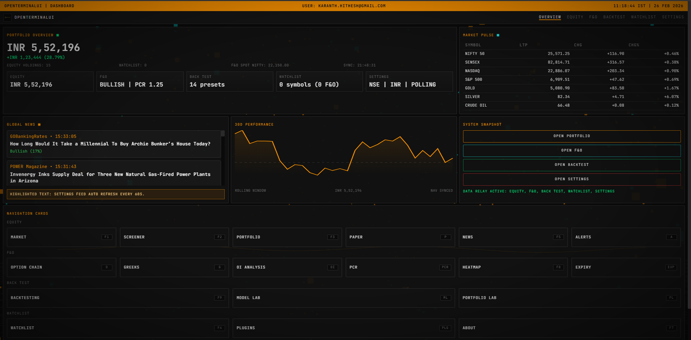
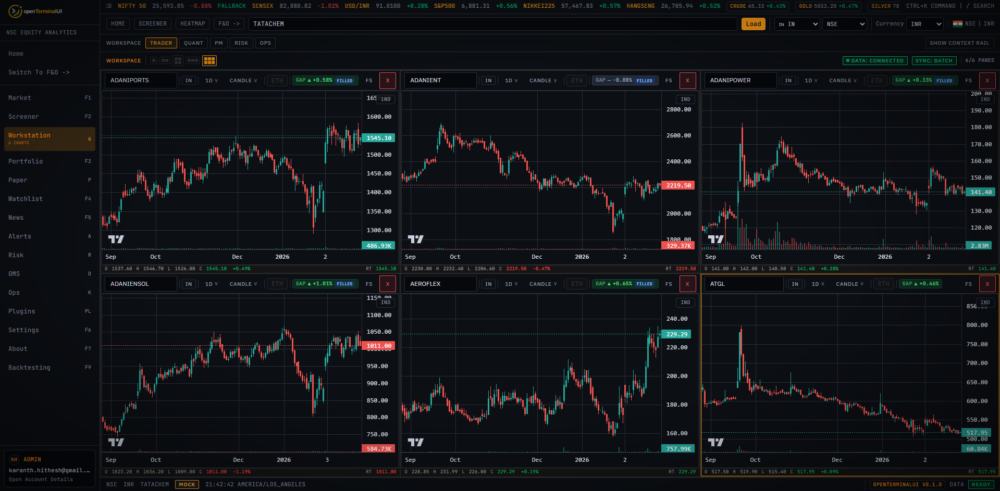

# OpenTerminalUI

- **Fonti dati:** [Multi-provider market data shell](https://finance.yahoo.com/) · [elenco completo](../data-sources/14-openterminalui.md)
- **Demo:** `localhost:8000` (self-host)
- **Stack:** Full-stack, shell stile Bloomberg/Refinitiv
- **Licenza:** —

## Screenshot UI

*Il README contiene 50+ screenshot in `assets/screenshots/`.*

## Dati free / open (ingestion)

**Elenco completo fonti dati (uno per uno):** [data-sources/14-openterminalui.md](../data-sources/14-openterminalui.md)

| Fonte | Dati | Auth |
|-------|------|------|
| **Yahoo Finance** | Quote fallback multi-mercato | Nessuna key |
| **Google RSS** | News fallback | Pubblico |
| **NSEPython** | India F&O, corporate actions | Open source lib |
| **OpenRouter** | Modelli `:free` per AI agent | Account free |
| **LM Studio / Gemma** | Inferenza locale | Nessuna key |
| **FinBERT / lexical** | Sentiment fallback | Locale |

Mercati: NSE, BSE, NYSE, NASDAQ, crypto, commodity, forex, bond, ETF. 70+ indicatori tecnici, option chain Greeks, backtest, paper trading.
