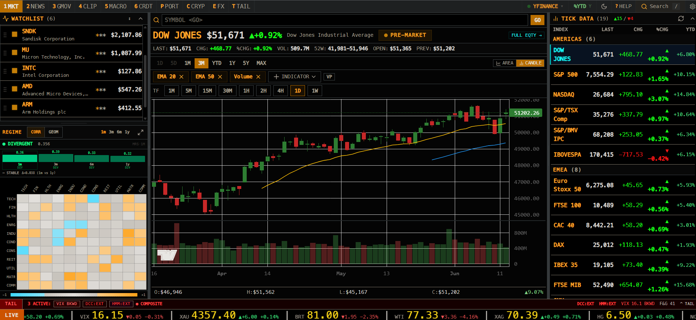

# triphopp / bloomberg-terminal

- **Fonti dati:** [FastAPI routers · macro/FRED/yfinance](https://fred.stlouisfed.org/) · [elenco completo](../data-sources/15-triphopp-bloomberg.md)
- **Demo:** `localhost:3000` + FastAPI `localhost:8000`
- **Stack:** Next.js 16, React 19, FastAPI, Jotai, Tailwind
- **Licenza:** —

## Screenshot UI

## Dati free / open (ingestion)

**Elenco completo fonti dati (uno per uno):** [data-sources/15-triphopp-bloomberg.md](../data-sources/15-triphopp-bloomberg.md)

| Fonte | Dati | Auth |
|-------|------|------|
| **Yahoo Finance / yfinance** | Quote primarie | Nessuna key |
| **Stooq** | Fallback EOD US + indici | Nessuna key |
| **FRED** | Macro, yield curve | **Free API key** |
| **Binance aggTrades** | Crypto order footprint | Pubblico |
| **Polymarket Gamma** | Prediction markets | Pubblico |
| **RSS** | News finance | Pubblico |
| **World Bank** | Dati sovrani | Pubblico |
| **Bank of Thailand** | Dati TH | Token opzionale |
| **SEC Thailand** | Open data TH | Key opzionale |
| **Ollama** | AI note locali | Locale |
| **Claude API** | AI cloud | Pay-per-use |

Viste: macro, portfolio, opzioni (Black-Scholes + Gram-Charlier), crypto footprint, regime detection. Keyboard: `1-6`, `P`, `C`, `E`, `/` search.
