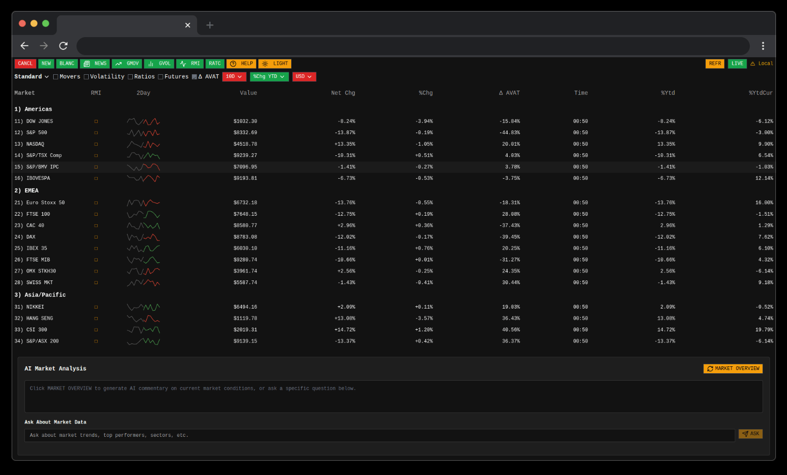

# feremabraz / bloomberg-terminal

- **Fonti dati:** [Simulated demo · Yahoo-style quotes](https://finance.yahoo.com/) · [elenco completo](../data-sources/16-feremabraz-bloomberg.md)
- **Stack:** Next.js 15, React 19, TypeScript
- **Licenza:** —

## Screenshot UI

## Dati free / open (ingestion)

**Elenco completo fonti dati (uno per uno):** [data-sources/16-feremabraz-bloomberg.md](../data-sources/16-feremabraz-bloomberg.md)

| Fonte | Dati | Auth |
|-------|------|------|
| **Simulated market data** | Quote, movers, volatility | Nessuna key — dati simulati |

Clone UI Bloomberg per dimostrazione. Nessun feed live reale documentato — refresh rate configurabile su dati mock.

Utile come riferimento **layout e UX**, non per ingestion dati reali.
