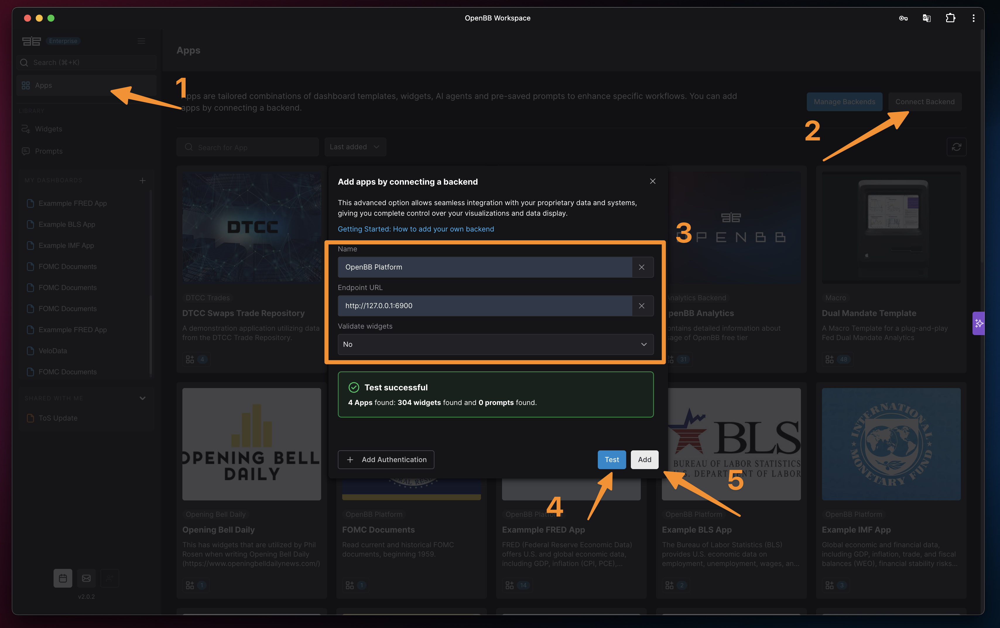

# OpenBB

- **Fonti dati:** [OpenBB Platform providers](https://docs.openbb.co/) · [elenco completo](../data-sources/17-openbb.md)
- **Workspace:** https://pro.openbb.co
- **Docs provider:** https://docs.openbb.co/python/reference
- **Stack:** Python (ODP), FastAPI backend
- **Licenza:** AGPLv3

## Screenshot UI

## Dati free / open (ingestion)

**Elenco completo fonti dati (uno per uno):** [data-sources/17-openbb.md](../data-sources/17-openbb.md)

`pip install openbb` — connettori integrati. Principali **senza costo** (molti richiedono free API key):

### Senza key

| Provider | Dati |
|----------|------|
| **yfinance** | Equity, ETF, crypto storico |
| **SEC** | Filings |
| **congress.gov** | Legislation |
| **government-us** | Dataset governo US |
| **Federal Reserve** | Serie Fed |
| **IMF** | Macro internazionale |
| **OECD** | Macro OECD |
| **US EIA** | Energia US |
| **BLS** | Labour statistics |
| **CFTC** | Commitment of traders |
| **EconDB** | Database economici |
| **TradingEconomics** | Indicatori (tier) |

### Free tier con registrazione

| Provider | Dati |
|----------|------|
| **FRED** | Macro US |
| **FMP** | Fundamentals |
| **Intrinio** | Market data |
| **Tiingo** | EOD data |
| **Benzinga** | News |
| **Alpha Vantage** | Quotes |
| **FINRA** | Short interest |
| **FINVIZ** | Screener |
| **NASDAQ** | Data |

Architettura "connect once, consume everywhere": Python, Workspace UI, Excel, MCP agents, REST API.
