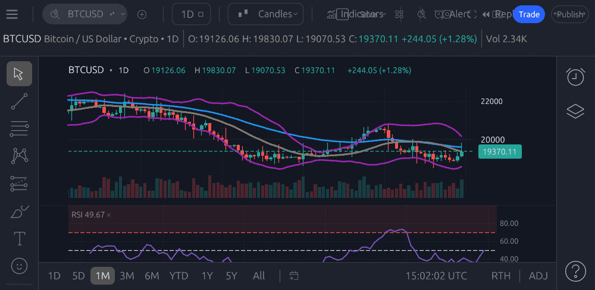

# egui-charts

- **Fonti dati:** [Host app defines feeds](https://userfrm.github.io/egui-charts/) · [elenco completo](../data-sources/18-egui-charts.md)
- **Demo live:** https://userfrm.github.io/egui-charts/
- **Stack:** Rust, egui — libreria (non terminal completo)
- **Licenza:** MIT / Apache-2.0

## Screenshot UI

## Dati free / open (ingestion)

**Elenco completo fonti dati (uno per uno):** [data-sources/18-egui-charts.md](../data-sources/18-egui-charts.md)

**Nessun feed bundled** — trait `DataSource` pluggable:

| Tipo | Implementazione |
|------|-----------------|
| **REST** | Custom provider |
| **WebSocket** | Custom provider |
| **CSV** | File locale |

La demo live usa dati di esempio / provider configurato nel host. 20 tipi chart, 130+ indicatori, 95 drawing tools, 5 temi preset.

Utile come riferimento per **migliorare chart.c** in STRAN o per future UI egui/wgpu.
